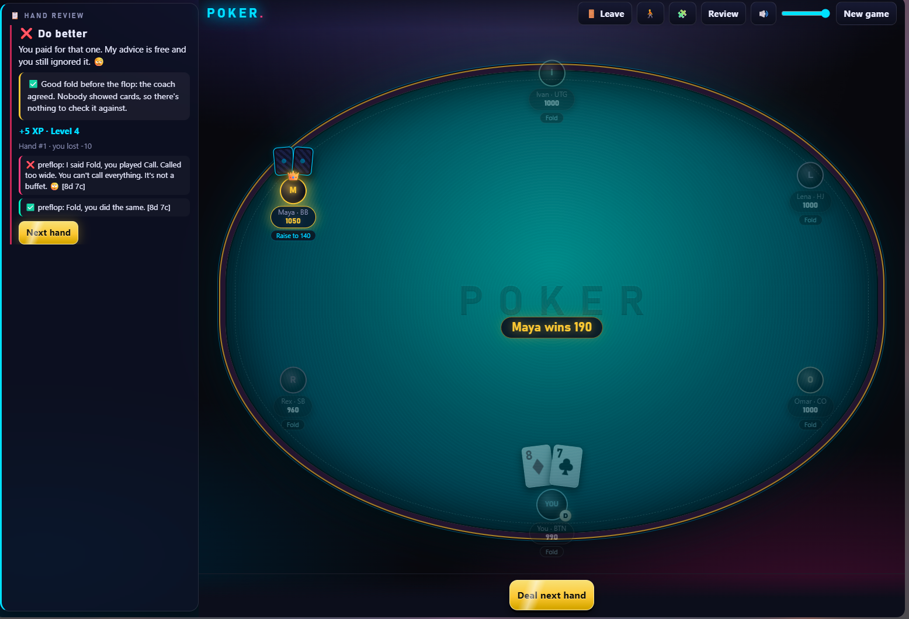
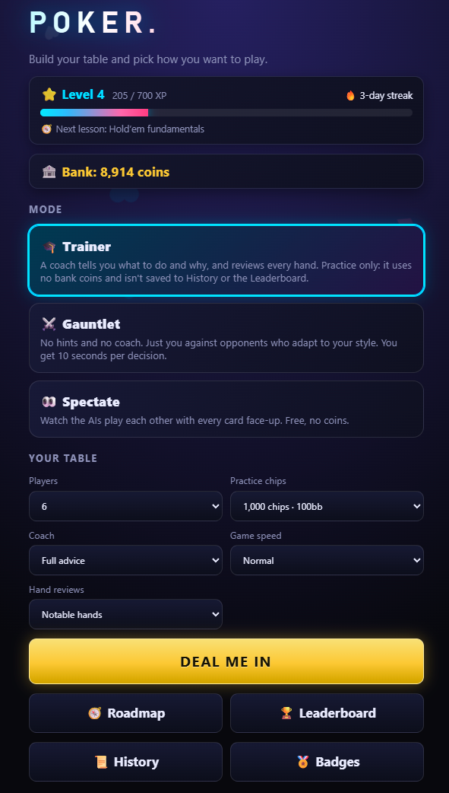
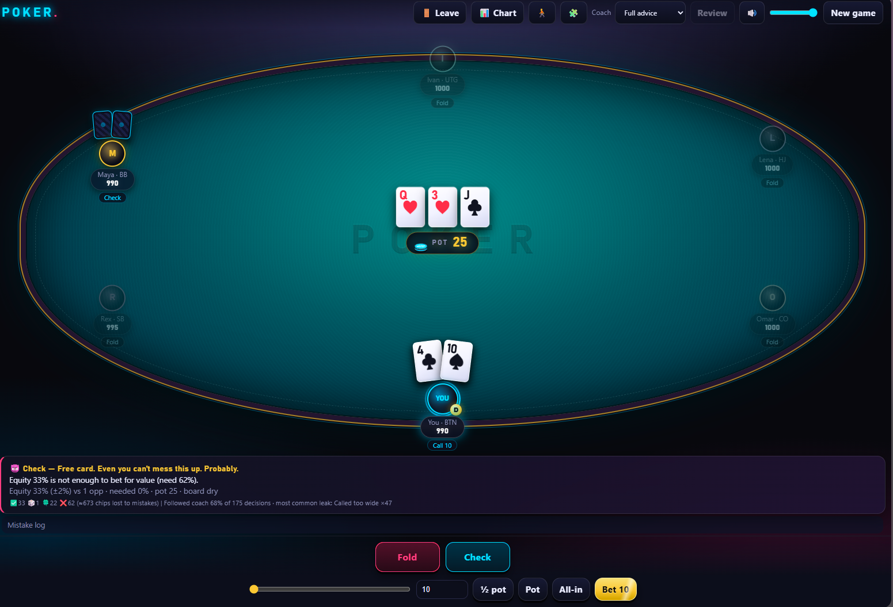
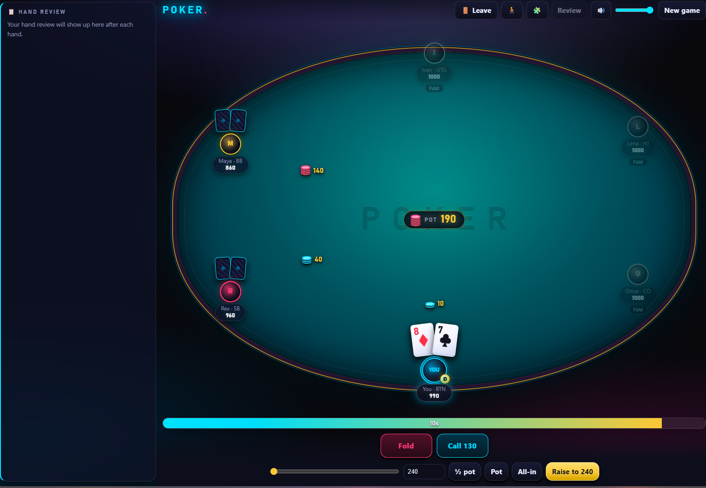
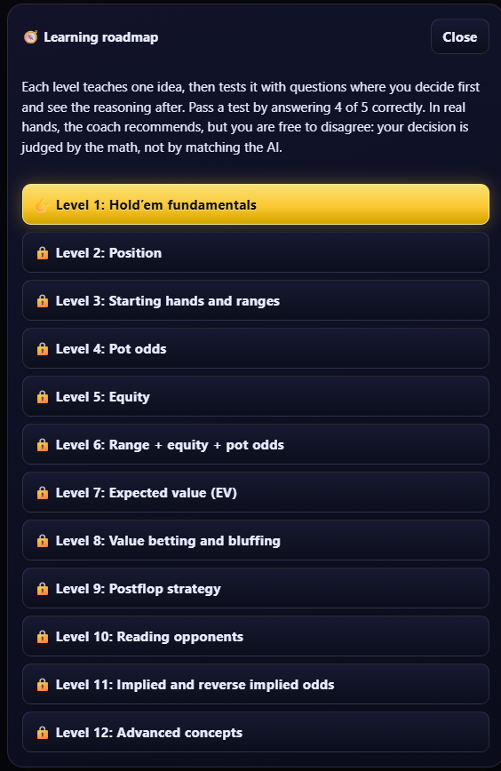

# Poker — an offline Texas Hold’em learning lab

https://flakeer.github.io/poker-trainer/

> **Vibe-coded with Claude Sonnet 5.5.** Built as a hands-on experiment in using AI to create a playable poker game and a place to learn poker by making decisions, testing ideas, and reviewing the reasoning afterward.

Poker is a browser-based Texas Hold’em trainer and AI-versus-AI sandbox. It runs locally, needs no account or backend, and uses no real money.

The goal isn't to teach you to blindly copy a bot. It's to help you build your own poker reasoning: *What hands could my opponent have? What are the pot odds? How much equity do I have? Is this decision profitable in the long run?*

## Why this project exists

I wanted more than a basic poker game. I wanted a personal poker laboratory where I could:

- Play hands and make my own decisions instead of following a scripted lesson.
- Learn poker concepts progressively, from the rules through equity, pot odds, expected value, bluffing, and advanced ideas.
- Compare my decisions with a coach's recommendation, then examine the reasoning.
- Watch AI opponents play one another with every card visible.
- Experiment with an offline AI and inspect how its decisions are made.

This is an experimental learning project—not a claim to have built a perfect poker solver.

## What you can do

### Trainer mode
Practice with a text-based coach that recommends an action and explains its reasoning. You can disagree with the recommendation. The purpose is to understand *why* a decision may be good, bad, or close—not to match the AI every time.

### Gauntlet mode
Play without coaching hints against AI opponents that adapt to observed tendencies. Decisions are timed, making this a more demanding way to test what you've learned.

### Spectate mode
Watch AI opponents play each other with all hole cards revealed. This is useful for observing hands and comparing different AI personalities.

### 12-level learning roadmap
The roadmap builds from fundamentals toward more advanced decision-making:

1. Hold’em fundamentals
2. Position
3. Starting hands and ranges
4. Pot odds
5. Equity
6. Range + equity + pot odds
7. Expected value (EV)
8. Value betting and bluffing
9. Postflop strategy
10. Reading opponents
11. Implied and reverse implied odds
12. Advanced concepts

Lessons use questions and poker situations so you can decide first and inspect the reasoning afterward.

### Progress and table features
- Session and lifetime statistics, hand history, mistake log, XP, badges, daily streaks, and leaderboard
- Synthesized sound effects and animated table feedback
- Responsive layout, including a side panel on wide screens
- A standalone HTML build that can be shared as a single file

## Decision quality matters more than the result

Poker has variance. A correct decision can lose a hand, and a poor decision can get lucky.

The trainer's review is designed to consider the decision rather than simply reward a win or punish a loss. Treat its analysis as a learning aid, not an infallible verdict: poker decisions depend on assumptions about opponents' ranges, available information, and the model's approximations.

## How the AI works

The project contains separate components for game rules, equity estimation, a fixed tight-aggressive trainer strategy, adaptive opponent behavior, and decision review. The equity engine uses Monte Carlo simulation and ranges to estimate equity; the opponents use heuristics and observed tendencies to choose actions.

**This is not a solver-grade, perfectly balanced, or guaranteed-winning AI.** Its recommendations are estimates produced by the project's models and assumptions. The code is intended to be explored, tested, and improved.

The game is designed to keep private information private during normal play: an opponent should only act on information available from its seat. Spectate mode deliberately reveals all hole cards for observation.

## Play locally

No installation, server, account, or network connection is required to play the standalone build.

1. Download or clone this repository.
2. Open `index.html` in a modern browser.

You can also open `dist/poker.html`, a self-contained build that includes the CSS and JavaScript in one file.

## Development

The project uses plain HTML, CSS, and JavaScript. The scripts are classic browser scripts loaded in the order listed in `index.html`; several core modules can also be loaded as Node modules.

### Project layout

| File | Purpose |
|---|---|
| `index.html` | Page structure and script loading |
| `css/style.css` | Styling, layout, and animation |
| `js/engine.js` | Dealing, betting, showdown, and pot rules |
| `js/equity.js` | Monte Carlo equity estimation and preflop ranges |
| `js/trainer.js` | Fixed tight-aggressive trainer strategy |
| `js/ai.js` | Adaptive AI opponents |
| `js/review.js` | Decision review and result classification |
| `js/vex.js` | Coach wording and personality |
| `js/stats.js` | Session/lifetime statistics and mistake log |
| `js/sfx.js` | Web Audio API sound effects |
| `js/ui.js` | Screens, controls, roadmap, bank, history, and leaderboard |
| `js/effects.js` | Visual effects |
| `js/tab-guard.js` | Single-tab guard intended to prevent duplicate local coins |
| `js/no-worker.js` | Disables Web Workers for compatibility with file-based play |
| `build.js` | Creates the standalone HTML build |
| `tests/fairness.test.js` | Fairness, hidden-card, and chip-conservation checks |

### Requirements

- A modern browser for playing
- Node.js for building the standalone file and running the test script

### Build the standalone HTML

```bash
node build.js
```

This writes `dist/poker.html` with CSS and JavaScript inlined. Rebuild it after changing source files.

### Run the tests

```bash
node tests/fairness.test.js
```

The test script simulates games across AI personalities and checks hidden-card access, shuffle behavior, and chip conservation.

## Screenshots



| Home | Trainer coach | Gauntlet |
|---|---|---|
|  |  |  |



## Data and privacy

The game's bank, XP, history, and leaderboard are stored in your browser's `localStorage`. The project does not need an account or server to play. Local browser storage is not tamper-proof; values can be changed through developer tools, and clearing site data may erase progress.

## Known limitations

- The AI is a heuristic, range-based learning opponent—not a state-of-the-art poker solver.
- Equity calculations are estimates and can vary with sampling and assumptions.
- A coach's recommendation can be wrong or debatable. Use it to question your reasoning, not replace it.
- Local statistics are useful for personal experimentation, not proof of skill or a reliable measure over a small sample.
- This project is for practice and entertainment, not real-money gambling or financial advice.

## Open source and contributions

This is a personal, AI-assisted project released in the open so others can explore it, learn from it, report issues, and contribute improvements.

Contributions and constructive feedback are welcome—especially around poker logic, testing, explainability, accessibility, usability, and making the learning experience clearer. Please include reproduction steps for bugs and explain the expected behavior when opening an issue.

This project is released under the [MIT License](LICENSE).

## AI-assisted development disclosure

This project was **vibe-coded with Claude Sonnet 5.5**. AI assistance was used in the development process; the repository is shared as an experiment in building, learning, testing, and iterating with AI. As with any AI-assisted codebase, review changes carefully, test behavior, and verify important claims rather than assuming generated code is correct.

## Disclaimer

This is a hobby learning project. It is provided “as is,” without warranties. It does not guarantee poker improvement, accurate strategic advice, or flawless behavior.
